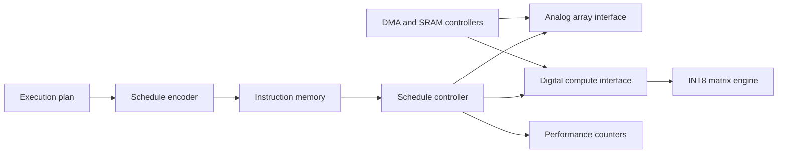

# RTL Architecture

## Schedule Word

The plan encoder emits one 32-bit word per operation:

| Bits | Meaning |
| --- | --- |
| 31 | target: analog=1, digital=0 |
| 30:27 | operator opcode |
| 26:16 | M tiles |
| 15:8 | K tiles |
| 7:0 | N tiles |

Tile counts are based on a configurable 128-element default. This is a compact
prototype ISA, not a frozen production ABI.

## Verification Scope

The testbench verifies analog and digital command dispatch, ready/valid
behavior, completion handling, tile metadata, and performance counters.
GitHub Actions runs Icarus Verilog simulation and Verilator lint.

`int8_matmul_engine` is a sequential, synthesizable reference datapath. It
stores signed INT8 activations and weights, performs one multiply-accumulate
per cycle, writes signed INT32 outputs, and exposes exact MAC/cycle counters.
The initial verification fixture computes a 2x4 by 4x2 matrix product.

The OpenLane configuration targets a 10 ns clock and includes only the
controller top. No checked-in timing, power, area, or GDSII claim is made until
the flow has run and its reports are published.
